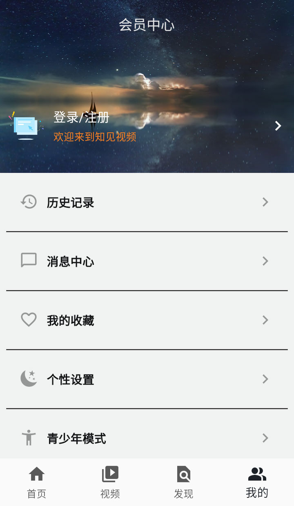
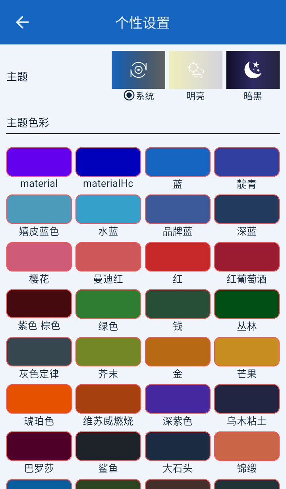

# 知见视频app客户端 flutter版

[English Version](README_EN.md)

知见是一款基于Flutter开发的视频和文章内容应用客户端，提供横屏和竖屏视频播放、文章阅读、用户系统等功能。

这是2年前写的一个flutter短视频的客户端,依赖可能比较老了如果使用新版本需要更新相关代码.

服务端: [https://github.com/jessejii/flutter-video-server](https://github.com/jessejii/flutter-video-server)

## 目录
- [功能特性](#功能特性)
- [技术栈](#技术栈)
- [项目结构](#项目结构)
- [环境要求](#环境要求)
- [安装与运行](#安装与运行)
- [项目配置](#项目配置)
- [主要页面](#主要页面)
- [状态管理](#状态管理)
- [第三方库](#第三方库)
- [贡献](#贡献)
- [许可证](#许可证)

## 功能特性

- 🎥 横屏和竖屏视频播放
- 📖 文章内容浏览
- 👤 用户系统（登录、注册、个人中心）
- 🌙 深色模式支持
- 👶 青少年模式
- 🔄 应用更新检查
- 🌍 国际化支持（中文、英文）
- 💾 数据缓存与持久化
- 📱 响应式设计，适配不同屏幕尺寸

## 技术栈

- [Flutter](https://flutter.dev/) - Google的UI工具包，用于构建跨平台应用
- [Dart](https://dart.dev/) - Flutter的编程语言
- [Riverpod](https://riverpod.dev/) - 状态管理解决方案
- [GoRouter](https://pub.dev/packages/go_router) - Flutter路由管理
- [Freezed](https://pub.dev/packages/freezed) - 数据模型代码生成
- [Hive](https://pub.dev/packages/hive) - 轻量级本地数据库

## 项目结构

```
lib/
├── api/                 # 网络请求接口
├── model/               # 数据模型
├── provider/            # 状态管理
├── routes/              # 路由配置
├── utils/               # 工具类
├── view/                # 页面组件
├── viewmodel/           # 视图模型
├── widget/              # 自定义组件
├── main.dart            # 应用入口
└── ...
```

## 环境要求

- Flutter 3.1.4 或更高版本
- Dart 3.1.4 或更高版本
- Android Studio / VS Code
- Android SDK / Xcode (用于构建对应平台的应用)

## 安装与运行

1. 克隆项目
```bash
git clone <repository-url>
```

2. 安装依赖
```bash
flutter pub get
```

3. 运行应用
```bash
flutter run
```

签名:
```
keytool -importkeystore -srckeystore C:\Users\Administrator\upload-keystore.jks -destkeystore C:\Users\Administrator\upload-keystore.jks -deststoretype pkcs12

keytool -genkey -v -keystore C:\Users\Administrator\upload-keystore.jks -storetype JKS -keyalg RSA -keysize 2048 -validity 10000 -alias xiaoyu
```

## 项目配置

应用的主要配置在 `lib/utils/config.dart` 文件中：

- `BASE_URL`: API基础地址
- `WEB_URL`: 网站地址
- `DEBUG`: 调试模式开关
- 超时设置等网络配置

## 主要页面

- **首页**: 包含横屏视频、竖屏视频和文章内容
- **视频详情页**: 视频播放页面
- **文章详情页**: 文章阅读页面
- **用户中心**: 个人资料、收藏、历史记录等
- **设置页面**: 应用设置、主题切换、青少年模式等
- **搜索页面**: 内容搜索功能

## 状态管理

项目使用Riverpod进行状态管理，主要的Provider包括：

- `appProvider`: 应用级别的状态管理
- `themeProvider`: 主题状态管理

## 第三方库

项目使用了以下主要的第三方库：

- `dio`: 网络请求
- `flutter_screenutil`: 屏幕适配
- `video_player`: 视频播放
- `cached_network_image`: 图片缓存
- `go_router`: 路由管理
- `bot_toast`: Toast提示
- `hive`: 本地数据存储
- `share_plus`: 分享功能
- `url_launcher`: 打开链接
- `permission_handler`: 权限管理

完整依赖列表请查看 [pubspec.yaml](pubspec.yaml) 文件。

## 贡献

欢迎提交Issue和Pull Request来改进这个项目。

## 许可证

## 应用截图

<div style="display: flex; flex-wrap: wrap; gap: 10px;">
  
  
  
  
  
</div>

相关


[https://blog.wodecun.com](https://blog.wodecun.com)
